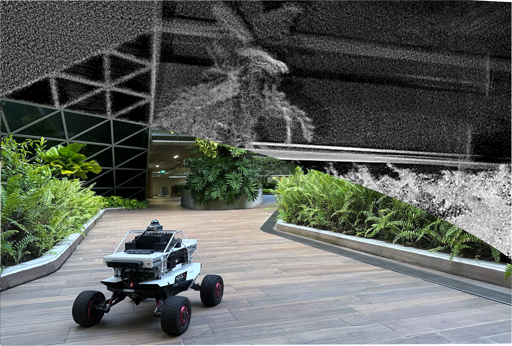
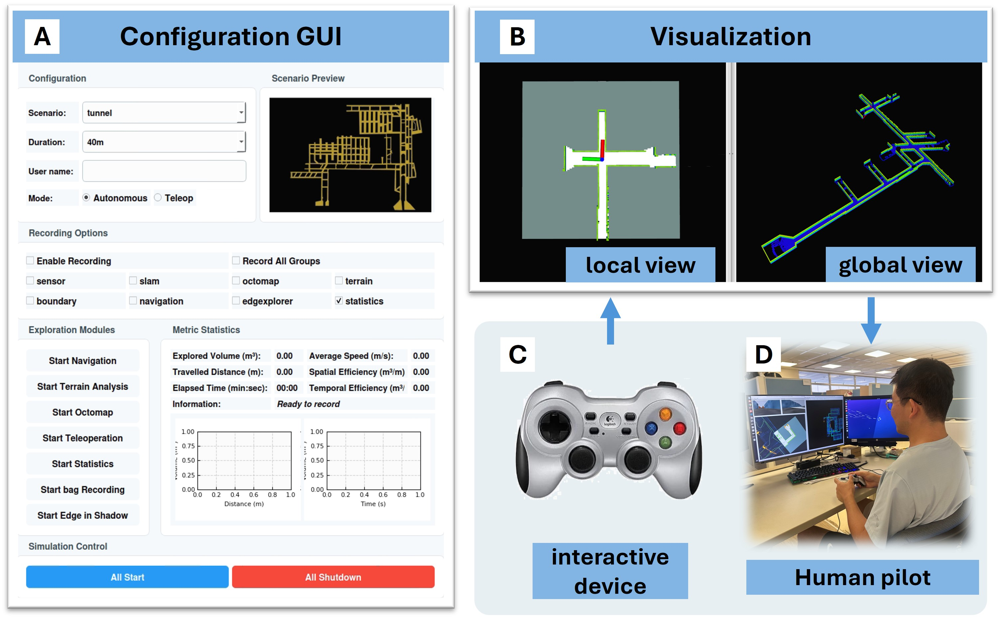

# Cognitive Exploration

Cognitive exploration is an exploration system designed to achieve human-level efficiency in exploring unknown environments. This repository contains the benchmarking system and the datasets obtained from experiments and simulations for the manuscript entitled:

> **"Cognitive Mapping and Decision-Making Enable Human-Level Efficiency in Robot Exploration"**

For detailed data availability, please refer to [./data/README.md](./data/README.md).

## Overview

This repository contains the implementation of the cognitive exploration (Cog Explore) method, designed for autonomous robot exploration and navigation benchmarking.

<p align="center">
  
</p>

## Prerequisites

- Docker installed on your system
- Git
- **NVIDIA Container Toolkit** (required for systems with NVIDIA GPU to ensure proper graphics rendering and visualization) 

## Quick Start

### 1. Clone the Repository

```bash
git clone https://github.com/JiyuanTHU/cog_explore.git
cd cog_explore
```

### 2. Setup Docker

Pull the pre-built Docker image:

```bash
docker pull ghcr.io/jiyuanthu/cog_explore:latest
```

#### For NVIDIA GPU Users

If you have an NVIDIA graphics card, install the NVIDIA Container Toolkit to enable GPU acceleration and proper graphics rendering:

```bash
# Add NVIDIA Container Toolkit repository
distribution=$(. /etc/os-release;echo $ID$VERSION_ID)
curl -s -L https://nvidia.github.io/nvidia-docker/gpgkey | sudo apt-key add -
curl -s -L https://nvidia.github.io/nvidia-docker/$distribution/nvidia-docker.list | sudo tee /etc/apt/sources.list.d/nvidia-docker.list

# Install NVIDIA Container Toolkit
sudo apt-get update
sudo apt-get install -y nvidia-container-toolkit

# Restart Docker daemon
sudo systemctl restart docker
```

**Troubleshooting**: If you encounter Docker credential errors, fix your Docker config:
```bash
mkdir -p ~/.docker
echo '{"auths": {}}' > ~/.docker/config.json
```

### 3. Run the Docker Container

```bash
cd docker
./run.sh
```

### 4. Execute into the Container

Open a new terminal and run:

```bash
cd docker
./exec.sh
```

## Benchmarking

### 1. Launch the Benchmarking Platform

Inside the Docker container, run:

```bash
cd /root/Ji_ws/ros2_ws/gui
python3 qt_teleop.py
```

This will open a GUI interface for benchmarking the proposed algorithm against human pilot performance. The interface is shown below:

<p align="center">
  
</p>

The GUI provides:
- **Local View**: First-person perspective for navigation
- **Global View**: Bird's-eye view of explored area
- **Metrics Statistics**: Real-time quantitative statistics and performance plots

### 2. Autonomous Exploration

To benchmark the proposed autonomous method:
1. Select **`Autonomous`** mode in the GUI
2. Click **`All Start`** to begin exploration

### 3. Human Teleoperation

To benchmark human pilot performance:
1. Select **`Teleop`** mode in the GUI
2. Click **`All Start`** to begin exploration
3. Use a gamepad/joystick to manually control the robot

#### Gamepad Configuration

This benchmark uses a **Logitech F710** gamepad with the following configuration:

```yaml
# Logitech F710 Gamepad Configuration
axes:
  linear: 1    # Left stick Y-axis (forward/backward)
  angular: 2   # Right stick X-axis (left/right turn)

buttons:
  activate: 2  # X button to toggle teleop on/off

# Button Mappings Reference
button_names:
  0: "A"
  1: "B" 
  2: "X"       # Teleop activate/deactivate
  3: "Y"
  4: "LB"      # Left bumper
  5: "RB"      # Right bumper
  6: "Back"
  7: "Start"
  8: "Xbox"
  9: "LS"      # Left stick click
  10: "RS"     # Right stick click

# Axis Mappings Reference
axis_names:
  0: "LS_X"    # Left stick X
  1: "LS_Y"    # Left stick Y (linear control)
  2: "LT"      # Left trigger
  3: "RS_X"    # Right stick X (angular control)
  4: "RS_Y"    # Right stick Y
  5: "RT"      # Right trigger
  6: "DPAD_X"  # D-pad X
  7: "DPAD_Y"  # D-pad Y
```

**Note**: The exploration results are continuously updated in the **Metrics Statistics** panel, showing both quantitative metrics and real-time performance plots.  

## Project Structure

```
├── docker/          # Docker configuration files
├── src/            # ROS 2 source packages
├── bash/           # Helper bash scripts
├── scripts/        # Utility scripts
├── gazebo_models/  # Simulation models
└── gui/            # GUI applications
```

## Author

Yuan Ji (yuan.ji@ntu.edu.sg)